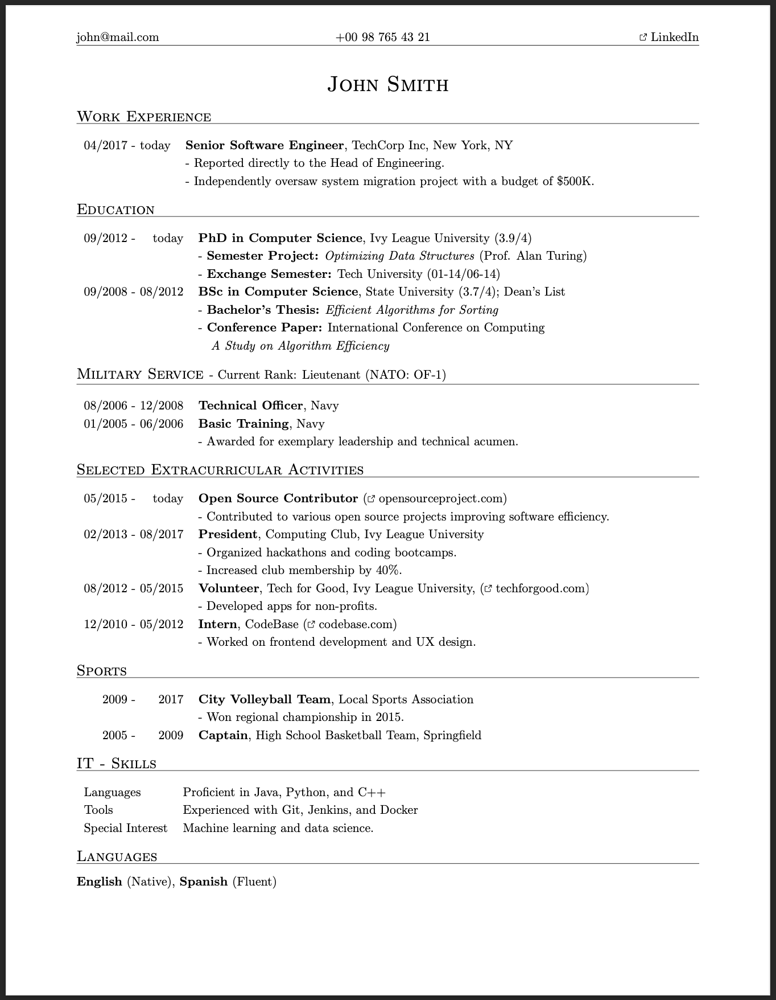

# Curriculum Vitae

This is a template for a curriculum vitae.

Import the class with the following statement to create the document.

```latex
\documentclass{cv}
```

See `example.tex` for an overview of the available commands.

